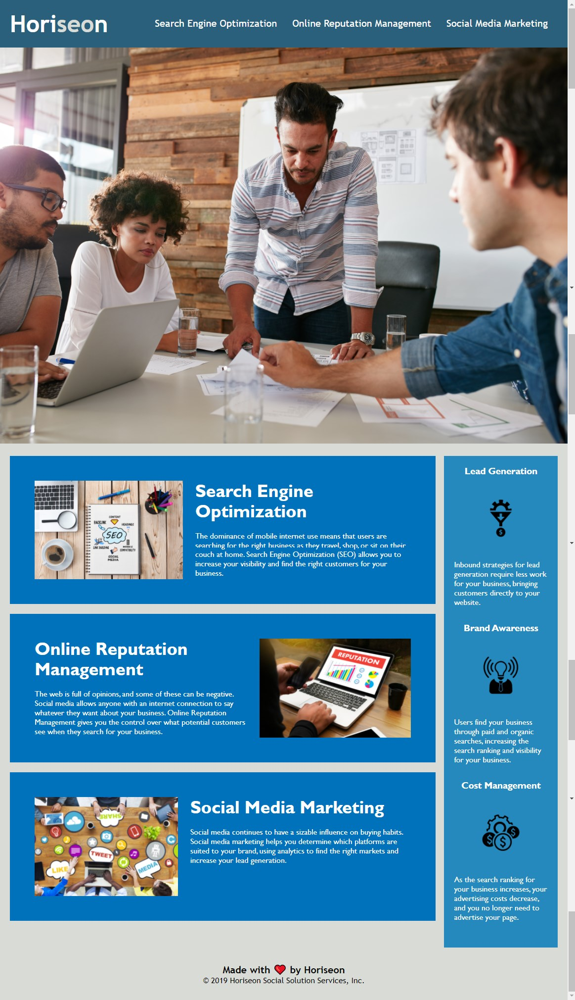

# Horiseon Marketing Agency
## Description:
Horiseon is digital marketing agency, website is designed to promote its business. Horiseon's mission is to help other businesses improve their online presence. Horiseon offers services such as Search Engine Optimization, Online Reputation Management, and Social Media Marketing all while increasing brand awareness and decreasing work and expenditures.

The website is designed mostly to be informative. Bright pictures are meant to attract viewers. Large headers and concise texts are meant to present the information simple and effectively. To add some interactivity, links on the nav bar can be clicked on to be directed towards the specific section. CSS is bright and colorful and easy to read. Additionally alt tags have been added to allow this website to be accesible to all.

**Website Link:**
https://irynashulim.github.io/Horiseon/

## Table of contents
* [Installation](#installation)
* [Usage](#usage)
* [Credits](#credits)
* [License](#license)

## Installation
In order to install this project, you must login to GitHub and go to https://github.com/irynashulim/Horiseon. Once there you will click on the green button that says clone or download. You will be given choices on how to download: using the ssh/html key or downloading the zip file.

Using SSH/HTML Key: You will copy the link shown and open up either terminal (mac: pre-installed) or gitbash (pc: must be installed). Once the application is open, you will type git clone paste url here. Once you have cloned the git horiseon repo, cd into the repo and type open . to open the folder which contains all files used for the website. Once inside the folder, click on index.html to open the website in the browser.

Using Download ZIP: Click on Download Zip. Locate the file and double click it to unzip the file. Locate the unzipped folder and and open it. All the files for the website will be within this folder. Click on index.html to open the website in the browser.

## Usage
Once on the website simply read through or use the buttons on the nav bar to direct you to a specific section within the page.

## Credits
I worked with Christopher Graves to resolve deployment issues and Rukshan Uddin to get help with ".gitignore" and "README" files.

## License
MIT License

Copyright (c) [2021] [Iryna Shulim]

Permission is hereby granted, free of charge, to any person obtaining a copy
of this software and associated documentation files (the "Software"), to deal
in the Software without restriction, including without limitation the rights
to use, copy, modify, merge, publish, distribute, sublicense, and/or sell
copies of the Software, and to permit persons to whom the Software is
furnished to do so, subject to the following conditions:

The above copyright notice and this permission notice shall be included in all
copies or substantial portions of the Software.

THE SOFTWARE IS PROVIDED "AS IS", WITHOUT WARRANTY OF ANY KIND, EXPRESS OR
IMPLIED, INCLUDING BUT NOT LIMITED TO THE WARRANTIES OF MERCHANTABILITY,
FITNESS FOR A PARTICULAR PURPOSE AND NONINFRINGEMENT. IN NO EVENT SHALL THE
AUTHORS OR COPYRIGHT HOLDERS BE LIABLE FOR ANY CLAIM, DAMAGES OR OTHER
LIABILITY, WHETHER IN AN ACTION OF CONTRACT, TORT OR OTHERWISE, ARISING FROM,
OUT OF OR IN CONNECTION WITH THE SOFTWARE OR THE USE OR OTHER DEALINGS IN THE
SOFTWARE.
